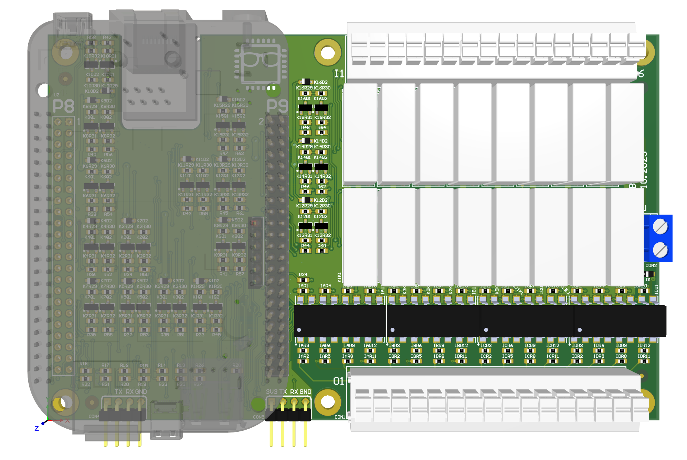
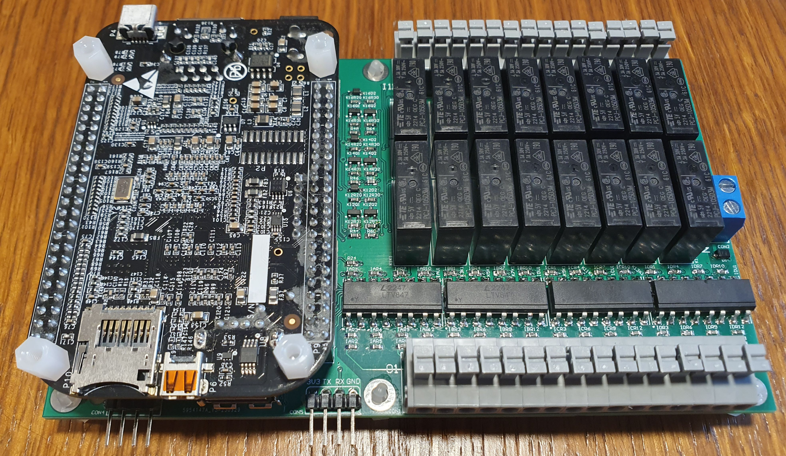

# BeagleNode

Home Assistant dedicated 230 VAC relay/ switch board. The repository is dedicated for the Altium PCB project.

## Schematics

The `deliverables_revX/schematics` directory consists of the schematics pdf exports in both logical (schematic parts are treated as objects/ classes) and physical (schematic parts are multiplied to 100% express the PCB designators) config.

## Altium project 3D view

## First board assembly (ver A)

